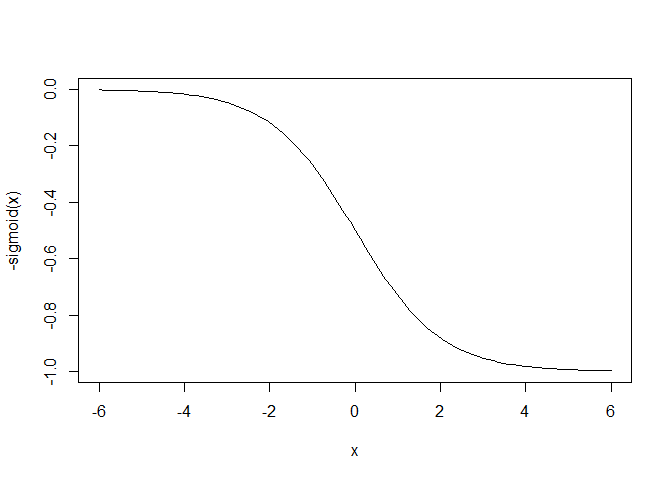

Make A Fake Cohort
================
AMNakamura
orig: 5/2/2014

This program generates a sample cohort from user inputs, some sample
categorical groups, and some seasonal terms for interest. Cohort members
can enter and leave the cohort at any time and switch groups mid-way
through.

``` r
# Set bounds around the cohort years
YrStart <- 2008
YrEnd   <- 2013


# Create some sample variables
GRPS  <- c("GRP1","GRP2","GRP3","GRP4")  # Some groups
GNDRS <- c("M","F","NB")                 # Some genders
PGMS   <- c("PGM1","PGM2","PGM3")         # Some programs


# Add some seasonal terms for interest 
library(scales)
library(e1071)


options(scipen = 999)
# The curve() function will create x and y coordinates for an S-curve.
# Start high then end low for this run. 
mos <- data.frame( m = seq.int( 1, 12, 1 ) )
p  <- invisible(curve(-sigmoid(x) , -6,6))
```

<!-- -->

``` r
x  <- rescale(p$x, to = c(1, 12))
y  <- rescale(p$y, to = c(0,1))
mt <- predict( loess( y ~ x, span=.1 ), mos$m )
```

Let data set members - Enter the cohort and leave the cohort at any
time - Change groups (e.g., classes) midway

``` r
# Start with a list of IDs

df0 <- data.frame(ID = seq(1:1000)) 

# Create some columns                 
GRP  <- sample(GRPS,  nrow(df0),replace=TRUE)  
GNDR <- sample(GNDRS, nrow(df0),replace=TRUE) 
PGM  <- sample(PGMS,   nrow(df0),replace=TRUE) 
YR   <- sample(YrStart:YrEnd,nrow(df0),replace=TRUE)
age  <- sample(18:45, nrow(df0),replace=TRUE)
MO   <- sample(1:12,nrow(df0),replace=TRUE)

               
df1 <- cbind.data.frame(df0,GRP,GNDR,PGM,YR,MO,age)   
```

``` r
suppressMessages(library(dplyr))

# Create new rows for the years in the span
n <- YrEnd - YrStart 

df2 <- df1 %>%
  slice(rep(seq_len(n()), each = n)) %>%  # Create up to 10 new rows
  group_by(ID) %>% 
  mutate_at(vars(YR,age), ~. + 0:(n - 1)) %>%   # increment year and age
  filter(YR <= YrEnd) %>%
  mutate(MO = ifelse(row_number() == 1,MO,1)) # Set the first month of subsequent years to 1

# Create new rows for the possible months
n <- 12 

df3 <- df2 %>%
  slice(rep(seq_len(n()), each = n)) %>%  # Create up to 12 new rows
  group_by(ID,YR) %>% 
  mutate_at(vars(MO), ~. + 0:(n - 1)) %>%   # increment month by 1
  filter(MO <= 12)  

# Select a sample of the cohort to switch groups and a sample to leave early.

switches <- sample(df3$ID, floor(nrow(df3)/3)) 
exits    <- sample(df3$ID, floor(nrow(df3)/10)) 

df4 <- df3 %>%
  group_by(ID) %>%
  mutate(dt        = as.Date(paste(YR,MO,1, sep="-")),
         dt.switch = sample(seq(min(as.Date(paste(YR,MO,1, sep="-"))),
                     max(as.Date(paste(YR,MO,1, sep="-"))),
                     by="month"),1),
         dt.out =    as.Date(ifelse(ID %in% exits,
                     sample(seq(min(as.Date(paste(YR,MO,1, sep="-"))),
                     max(as.Date(paste(YR,MO,1, sep="-"))),
                     by="month"),1),
                     NA),origin="1970-01-01"),
         GRP = ifelse(ID %in% switches & dt > dt.switch,
                          sample(GRPS,1) ,as.character(GRP)))  %>%
  filter(is.na(dt.out)|dt < dt.out ) %>%
  ungroup() %>%
  dplyr::select(-c(dt.switch,dt.out))

# Create a column with some data generated from the other columns, with some random variation and a little seasonal impact
df <- df4 %>%
  mutate(ind1 =YR*MO*match(GRP,GRPS)*age*match(GNDR,GNDRS)*(mt[MO]*(match(GRP,GRPS)-1))/1000) %>%
  rowwise() %>%
  mutate(ind2 =rnorm(1,mean=5,sd=1)*match(GNDR,GNDRS)*match(PGM,PGMS)) %>%
  mutate_if(is.numeric, round, digits=2) %>%
  ungroup()

rm(df0,df1,df2,df3,df4)
```

# Data Checks

The following prints out quick data profiles to serve as sanity checks
before using the fake data for any actual testing.

``` r
suppressMessages(library(inspectdf))
suppressMessages(library(tidyverse))


inspect_types(df) %>% show_plot()
```

<!-- -->

``` r
inspect_na(df) %>% show_plot()
```

<!-- -->

# Quick Profile

``` r
suppressMessages(library(summarytools))
suppressMessages(library(webshot))


print(dfSummary(df,
                varnumbers = FALSE,
                valid.col  = FALSE,
                graph.magnif = 0.75), 
      method = "browser", file = "MkChrtDfSummary.html")

webshot( "MkChrtDfSummary.html", "MkChrtDfSummary.png")
```

<!-- -->
[Stats Snapshot](MkChrtDfSummary.png)

# References

<div id="refs" class="references csl-bib-body hanging-indent">

<div id="ref-R-summarytools" class="csl-entry">

Comtois, Dominic. 2022. *Summarytools: Tools to Quickly and Neatly
Summarize Data*. <https://github.com/dcomtois/summarytools>.

</div>

<div id="ref-R-Hmisc" class="csl-entry">

Harrell, Frank E, Jr. 2022. *Hmisc: Harrell Miscellaneous*.
<https://hbiostat.org/R/Hmisc/>.

</div>

<div id="ref-R-e1071" class="csl-entry">

Meyer, David, Evgenia Dimitriadou, Kurt Hornik, Andreas Weingessel, and
Friedrich Leisch. 2021. *E1071: Misc Functions of the Department of
Statistics, Probability Theory Group (Formerly: E1071), TU Wien*.
<https://CRAN.R-project.org/package=e1071>.

</div>

<div id="ref-R-inspectdf" class="csl-entry">

Rushworth, Alastair. 2021. *Inspectdf: Inspection, Comparison and
Visualisation of Data Frames*.
<https://alastairrushworth.github.io/inspectdf/>.

</div>

<div id="ref-R-tidyverse" class="csl-entry">

Wickham, Hadley. 2021. *Tidyverse: Easily Install and Load the
Tidyverse*. <https://CRAN.R-project.org/package=tidyverse>.

</div>

<div id="ref-tidyverse2019" class="csl-entry">

Wickham, Hadley, Mara Averick, Jennifer Bryan, Winston Chang, Lucy
D’Agostino McGowan, Romain François, Garrett Grolemund, et al. 2019.
“Welcome to the <span class="nocase">tidyverse</span>.” *Journal of Open
Source Software* 4 (43): 1686. <https://doi.org/10.21105/joss.01686>.

</div>

<div id="ref-R-dplyr" class="csl-entry">

Wickham, Hadley, Romain François, Lionel Henry, and Kirill Müller. 2022.
*Dplyr: A Grammar of Data Manipulation*.
<https://CRAN.R-project.org/package=dplyr>.

</div>

<div id="ref-R-scales" class="csl-entry">

Wickham, Hadley, and Dana Seidel. 2022. *Scales: Scale Functions for
Visualization*. <https://CRAN.R-project.org/package=scales>.

</div>

</div>
