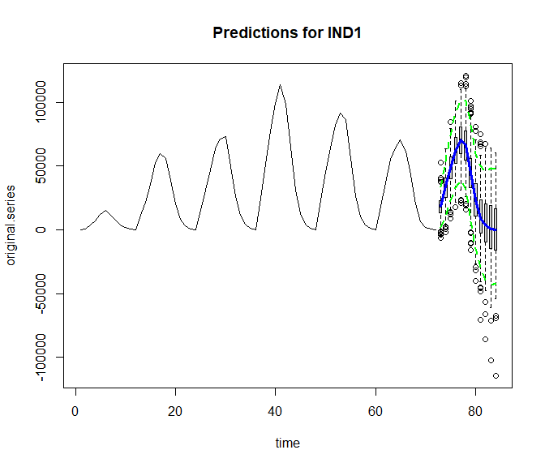
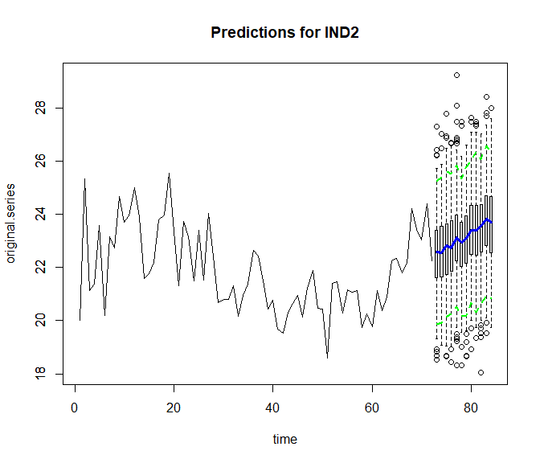
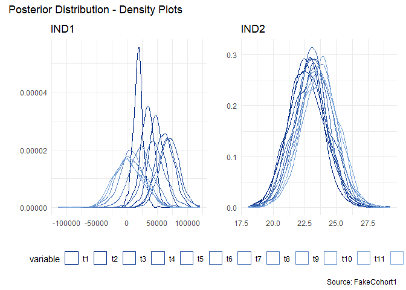
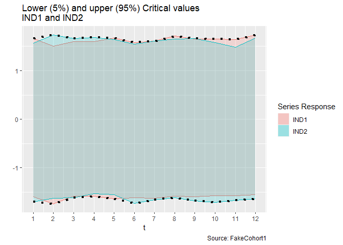
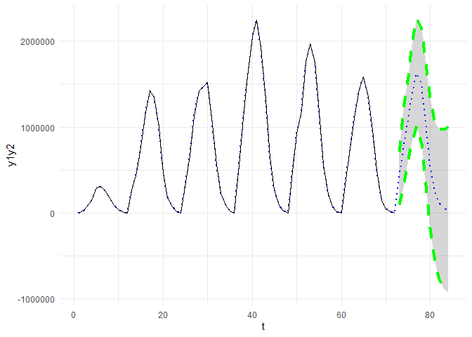

Using the delta method to combine two BSTS time series forecasts
================
Ann Nakamura

<H1>
Calculating the variance for the product of two forecasts, created using
a BSTS model
</H1>

# Use case

Create a composite estimate, based on the product of two time series
forecasts, fit using Bayesian Structural Time Series (BSTS) models.

# Data prep

## Time series samples

Examples use fake data, created using random group and variable
assignment. `FakeCohort1` contains a unique identifier (ID), a group
membership (GRP1–GRP4), a program membership (PGM1–PGM3), some
demographics (age), dates (MO,YR,dt), and a couple of numeric variables
(ind1 and ind2).

``` r
options(scipen = 999) # use anytime big or small numbers in play
library(tidyverse)

db1 <- read.table("https://raw.githubusercontent.com/AMNakamura/miscellanea/master/datasets/
FakeCohort1.txt",sep="|",header=T) %>% subset(GRP == "GRP2") %>%
  group_by(YR,MO) %>%
  arrange(MO) %>%
  add_column(x1 = runif(nrow(.)),
             x2 = runif(nrow(.))) %>%
  summarise(IND1 = sum(ind1),
            IND2 = mean(ind2),
            x1   = sum(x1),
            x2   = sum(x2)) %>%
  ungroup() %>%
  dplyr::select(YR,MO,IND1,IND2,x1,x2) %>%
  mutate(dt = as.Date(paste(YR,MO,"01",sep="-"))) 
```

## Date wrangling

Set date boundaries and forecast horizon length. For this run, use the
whole series. Omit the testing hold-out. Just set the horizon.

``` r
library(lubridate)

# Training start and stop
train.start.dt <- min(db1$dt)
train.stop.dt  <- max(db1$dt)
forecast.start.date <- train.stop.dt %m+% months(1)  

# Let H be 12 months out
H <- 12
horizon.end <- as.character(as.Date(train.stop.dt) %m+% months(H))

# Sequences of training, forecasting, and full date ranges (to reattach to time series), all first of the month.

training_dates  <-
as.data.frame(seq(as.Date(train.start.dt),as.Date(floor_date(as.Date(train.stop.dt))),by="month")) %>%
rename(ds = 1)

forecast_dates     <- as.data.frame(seq(as.Date(forecast.start.date), length = H, by = "month")) %>%
rename(ds = 1)
```

# Quick Forecasts

Steps below rely mainly on Steven Scott’s **bsts** package to create the
`bsts` objects and Rob Hyndman’s **forecast** package to create
univariate forecasts for predictors.

## Predictors

``` r
library(forecast)
# Simple model for each. Leave out upper and lower bounds
attach(db1)
GetFcast <- function(v){
  uni.mod <- HoltWinters(ts(v,
           frequency = 12,
           start = c(2008,1)))
  ftmp    <- forecast(uni.mod,H)
  f.df    <- as.numeric(ftmp$mean) 
}
f.x1 <- cbind.data.frame(GetFcast(x1),forecast_dates) %>% dplyr::rename(x1 =1)
f.x2 <- cbind.data.frame(GetFcast(x2),forecast_dates) %>% dplyr::rename(x2 =1)
```

## Response

``` r
library(bsts)

### Series 1
# Create State Specification object, ss
sdy  <- sd(IND1, na.rm = TRUE)
sd.prior <- SdPrior(sigma.guess = 2 * sdy) # Guesstimate to start from

ss   <- list()  
ss   <- AddLocalLevel(ss,IND1,sigma.prior=sd.prior, sdy=sdy)
Ss   <- AddAr(ss,IND1,lags=2,sdy=sdy)
ss   <- AddSeasonal(ss,IND1,nseasons = 12)
mod1 <- invisible(bsts(IND1 ~ x1, ss, niter = 1000, seed = 1234))
```

``` r
### Series 2
ss   <- list()  
sdy  <- sd(IND2, na.rm = TRUE)
ss   <- AddStaticIntercept(ss,IND2,initial.state.prior = NormalPrior(IND2[1],sdy))
mod2 <- invisible(bsts(IND2 ~ x2, ss, niter = 1000, seed = 1234))
```

## Predictions

``` r
pred1 <- predict(mod1, newdata= f.x1 ,horizon=H, seed=12345,
                  burn = 500, quantiles = c(.05, .95))

plot(pred1, main="Predictions for IND1", style="boxplot")
```



``` r
pred2 <- predict(mod2, newdata= f.x2 ,horizon=H, seed=12345,
                  burn = 500, quantiles = c(.05, .95))

plot(pred2, main="Predictions for IND2", style="boxplot")
```



# Distributions

The posterior distribution from the **bsts** `pred()` is a matrix used
to measure the uncertainty of predictions. MCMC draws come from the
posterior predictive distribution that combines the prior distribution
(default gamma as a starting point), adjusted to reflect the likelihood
function created from the data you provided.

``` r
d1  <- as.data.frame(pred1[["distribution"]]) %>%
  mutate(draw = row_number())

d2 <- as.data.frame(pred2[["distribution"]]) %>%
  mutate(draw = row_number())

names(d1)[1:H] <- paste("t", 1:H, sep="")
names(d2)[1:H] <- paste("t", 1:H, sep="")
```

## Plots

``` r
ramp0 = colorRampPalette(c(hcl(245,50, # h = 245 (bluish), chroma = 50 (a little grey)
                           c(10,70)))  # luminance (how much white to add): 50 and 10 
                           )

library(reshape2) # For the melt function

d1.long <- melt(d1, id.vars="draw")
d2.long <- melt(d2, id.vars="draw")

d1.p <- ggplot(d1.long, aes(value,color=variable)) + 
        geom_density() +
        scale_color_manual(values=ramp0(H)) + 
        labs(title="IND1", y="", x="") 


d2.p <- ggplot(d2.long, aes(value,color=variable)) + 
        geom_density() +
        scale_color_manual(values=ramp0(H)) + 
        labs(title="IND2", y="", x="")

library(patchwork)

wrap_plots(d1.p, d2.p) + plot_annotation(
  title = 'Posterior Distribution - Density Plots',
  caption = 'Source: FakeCohort1'
)+ plot_layout(guides = "collect") & theme_minimal() & theme(legend.position = "bottom") & guides(colour = guide_legend(nrow = 1))
```


Next steps find the upper and lower plausible prediction ranges by
calculating critical values for each posterior distribution. Two values,
`lb.strict` and `ub.strict` select the value farthest from zero,
representing the most conservative option for selecting a values beyond
which observations would be considered “extreme” or unexpected.

``` r
# Obtain upper and lower critical values from the quantile function

crit05.1 <- as.numeric(apply(scale(pred1$distribution,center=TRUE,scale=TRUE), 2,function(f){quantile(f,0.05)}))
crit95.1 <- as.numeric(apply(scale(pred1$distribution,center=TRUE,scale=TRUE), 2,function(f){quantile(f,0.95)}))

crit05.2 <- as.numeric(apply(scale(pred2$distribution,center=TRUE,scale=TRUE), 2,function(f){quantile(f,0.05)}))
crit95.2 <- as.numeric(apply(scale(pred2$distribution,center=TRUE,scale=TRUE), 2,function(f){quantile(f,0.95)}))

crit1 <- cbind.data.frame(crit05.1,crit95.1) %>% mutate(t = row_number(), ts="IND1") %>% rename(lb1 = 1, ub1=2)  
crit2 <- cbind.data.frame(crit05.2,crit95.2) %>% mutate(t = row_number(), ts ="IND2") %>% rename(lb2 = 1, ub2=2)

crit <- left_join(crit1,crit2,by="t") %>%
  rowwise() %>%
  mutate(lb.strict = min(lb1,lb2),
         ub.strict = max(ub1,ub2))
```

``` r
ggplot(data=crit, aes(x=t)) + 
  geom_ribbon(aes(ymin = lb1,ymax = ub1, fill=ts.x), alpha=0.2) +
  geom_line(aes(y=ub1, color=ts.x)) + 
  geom_line(aes(y=lb1, color=ts.x)) + 
      
 geom_ribbon(aes(ymin = lb2,max = ub2, fill=ts.y), alpha=0.2) + 
  geom_line(aes(y=ub2, color=ts.y)) + 
  geom_line(aes(y=lb2, color=ts.y)) + 
  
 geom_line(aes(y=lb.strict), size=1.5, lty="dotted") + 
 geom_line(aes(y=ub.strict), size=1.5, lty="dotted") +
  labs(title="Lower (5%) and upper (95%) Critical values \nIND1 and IND2",
       caption = "Source: FakeCohort1", 
       y='') + 
   scale_x_continuous(breaks= c(1:12)) +
  scale_fill_discrete(name = "Series Response") +
  guides(color="none")
```



# Creating a composite (product)

The following applies the delta method, using the **matrixStats**
package to perform functions on columns from the MCMC draws.

``` r
library(matrixStats)  

# Exp(y1) and Exp(y2)

y1.hat    <- pred1$mean   # Same as colMeans2(pred1[["distribution"]]) 
y2.hat    <- pred2$mean   # Same as colMeans2(pred2[["distribution"]]) 

y1.var  <- colVars(pred1[["distribution"]])    # Estimates for point-wise var
y2.var  <- colVars(pred2[["distribution"]])    # Estimates for point-wise var

# Exp(y1)^2 and Exp(y2)^2 (squared expected values)

y1.hat2 <- y1.hat**2 # square each element
y2.hat2 <- y2.hat**2 # square each element

# Delta term1: Var(y2)*Exp(y1)**2
var2.exp1  <- y2.var*y1.hat2
# Delta term2: Var(y1)*Exp(y2)**2
var1.exp2  <- y1.var*y2.hat2

# Build term 2:

# 2* y1 * y2 per month
y1.y2  <- as.numeric(y1.hat*t(y2.hat)) 

# covariance y1,y2
covar <- diag(cov(pred1[["distribution"]],
                  pred2[["distribution"]]))

# Composite variance 
var.delta   <- var2.exp1 + var1.exp2 + 2*y1.y2*t(covar)
std.delta   <- as.numeric(var.delta**(.5))  # Square root of the variance

crit.lb <- crit$lb.strict
crit.ub <- crit$ub.strict

obs <- db1 %>% 
  mutate(y1y2 = IND1*IND2) %>%
  dplyr::select(y1y2) %>%
  mutate(t = row_number())

delta <- cbind.data.frame(y1.y2, 
                          y1.y2 + std.delta*crit.lb,
                          y1.y2 + std.delta*crit.ub
               )
colnames(delta) <- c("y1y2","y1y2.lb","y1y2.ub")

delta$t <- 72 + seq(1:H)

comp <- bind_rows(obs,delta)

ggplot(data=comp,aes(x=t)) + 
  geom_ribbon(aes(ymin = y1y2.lb,ymax = y1y2.ub), color="grey90",alpha=0.2) +
  geom_line(aes(y=y1y2), color="blue", lty="dotted", size=1) +
  geom_line(aes(y=y1y2.lb), color="green", lty="dashed", size=1.5) +
  geom_line(aes(y=y1y2.ub), color="green", lty="dashed", size=1.5) +
  geom_line(data=obs, aes(y=y1y2), color="black") + 
  theme_minimal()
```



# References - Software

Wickham et al., (2019). Welcome to the tidyverse. Journal of Open Source
Software, 4(43), 1686, <https://doi.org/10.21105/joss.01686>

Steven L. Scott (2022). bsts: Bayesian Structural Time Series. R package
version 0.9.8. <https://CRAN.R-project.org/package=bsts>

Henrik Bengtsson (2022). matrixStats: Functions that Apply to Rows and
Columns of Matrices (and to Vectors). R package version 0.62.0.
<https://CRAN.R-project.org/package=matrixStats>

Hyndman R, Athanasopoulos G, Bergmeir C, Caceres G, Chhay L, O’Hara-Wild
M, Petropoulos F, Razbash S, Wang E, Yasmeen F (2022). *forecast:
Forecasting functions for time series and linear models*. R package
version 8.17.0, \<URL: <https://pkg.robjhyndman.com/forecast/>\>.

Hyndman RJ, Khandakar Y (2008). “Automatic time series forecasting: the
forecast package for R.” *Journal of Statistical Software*, *26*(3),
1-22. doi: 10.18637/jss.v027.i03 (URL:
<https://doi.org/10.18637/jss.v027.i03>).

Thomas Lin Pedersen (2020). patchwork: The Composer of Plots. R package
version 1.1.1. <https://CRAN.R-project.org/package=patchwork>
