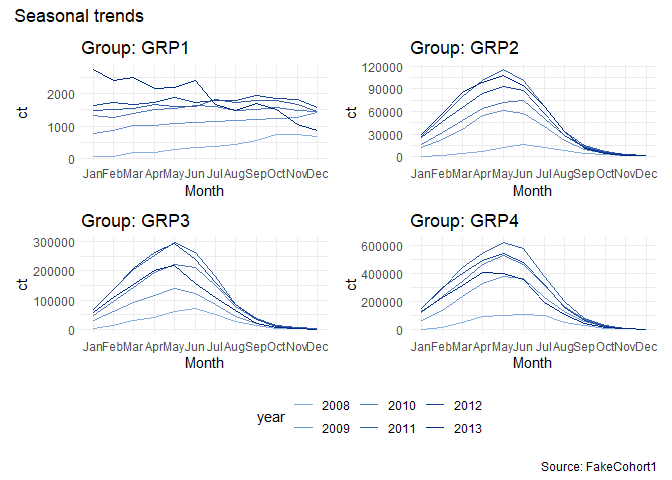
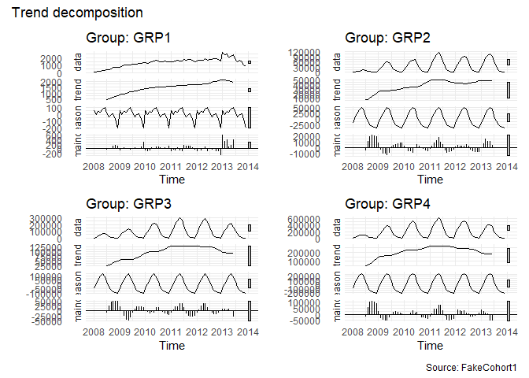
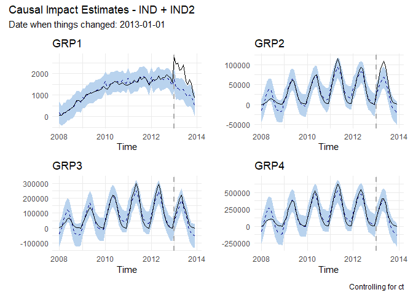

Counterfactual Dashboard Sample
================
Ann

<H1>
Quick - Interrupted Time Series Dashboards
</H1>

# Use Case

Quickly get a visual sense of the potential impact of an environmental
change on a number of different time series. This example uses the
**CausalImpact** package to create the models (Bayesian structural time
series (BSTS)) and a set of graphs showing the difference between the
what *was expected to happen in the absence of the change*
(counterfactual) and *what actually happened*, accounting for trends and
seasonality.

# Data Prep

## FakeCohort1

Examples use fake data, created using random group and variable
assignment. `FakeCohort1` contains a unique identifier (ID), a group
membership (GRP1–GRP4), a program membership (PGM1–PGM3), some
demographics (age), dates (MO,YR,dt), and a couple of numeric variables
(ind1 and ind2).

``` r
db1 <- read.table("https://raw.githubusercontent.com/AMNakamura/miscellanea/master/datasets/FakeCohort1.txt",sep="|",header=T)
```

## Identify the Pre- and Post- Periods

The following takes a single date and uses it to divide the time series
into two mutually exclusive periods.

``` r
dts <- sort(unique(db1$dt)) # All dates

i.dt0 <- "2013-01-01"  # Interruption 

# Calculate other dates automatically.

# Index-based 
t.pre <- which(dts == i.dt0) -1
t.post <- t.pre + 1

period.pre  <- c(1, t.pre)
period.post <- c(t.post, length(dts))

# Date based
library(lubridate)

t.start <- min(dts)
t.pre   <- i.dt0
t.post  <- as.character(as.Date(t.pre) %m+% months(1))
t.end   <- max(dts)

period.pre  <-  as.Date(c(t.start, t.pre))
period.post <- as.Date(c(t.post, t.end))
```

## Create series

Use list processing to create a series of data frames and a series of
time series.

``` r
suppressMessages(library(tidyverse))

options(scipen=999)

db1 <- read.table("https://raw.githubusercontent.com/AMNakamura/miscellanea/master/datasets/FakeCohort1.txt",sep="|",header=T)

glst <- sort(unique(as.character(db1[,2])))

series.df <- list()
series.ts <- list()

for (g in glst){
  
i  <- as.numeric(gsub("[[:alpha:]]", "", g))  

series.df[[i]] <- subset(db1, GRP == g) %>%
  group_by(YR,MO,GRP) %>%
  summarise(IND = sum(ind2 + ind1),
            ct = n_distinct(ID)) %>%
  dplyr::select(YR,MO,GRP,IND,ct) %>%
  mutate(dt = as.Date(paste(YR,MO,"01",sep="-")),
         IND = ifelse(dt < as.Date(i.dt0),IND,IND * (1 + 1/i))) %>%
  ungroup()

series.ts[[i]]= ts(series.df[[i]]$IND,
           frequency = 12,
           start = c(2008,1))

}
```

## Create a palette generator function

Create a palette generator that can increase and decrease in size
without changing the general look and feel too much. Using the **R
Graphics Devices**, the `hcl()` and `colorRampPalette()` functions can
create the palette members and a function to generate a palette of any
size. This one matches the default output from **CausalImpact** graphs.

``` r
# hcl() takes a triplet(hue, chroma, intensity)

ramp0 = colorRampPalette(c(hcl(245,50, # h = 245 (bluish), chroma = 50 (a little grey)
                           c(10,70)))  # luminance (how much white to add): 50 and 10 
                           )
```

## Assumptions

Pre-cooked (fake) data has values that tend to circle around a constant
long-run/long-term mean; pre-interruption and post-intervention
predictor-response relationships are fairly stable (e.g., no phase
shifts); and errors are normally distributed (loose assumption).

Assume observations aren’t independent and identically distributed
(iid) - what happens next in the time series can be predicted somewhat
by what’s happened previously. Data may have fat tails and volatility
clustering.

# Eyeball inspection of seasonality

``` r
suppressMessages(library(forecast))

season.p <- list()
decomp.p <- list()


for (g in glst){
  
i  <- as.numeric(gsub("[[:alpha:]]", "", g)) 

n <- n_distinct(db1$YR)

season.p[[i]] <- ggseasonplot(x=series.ts[[i]],col=rev(ramp0(n))) +
  ylab("ct") +
  xlab("Month") + 
  labs(title=glue::glue("Group: {g}")) 

tmp <- decompose(series.ts[[i]])

decomp.p[[i]] <- forecast::autoplot(tmp,main=glue::glue("Group: {g}"))

}
```

``` r
library(patchwork)

wrap_plots(season.p) + plot_annotation(
  title = 'Seasonal trends',
  caption = 'Source: FakeCohort1'
)+ plot_layout(guides = "collect") & theme_minimal() & theme(legend.position = "bottom") 
```

<center>

</center>

``` r
wrap_plots(decomp.p) + plot_annotation(
  title = 'Trend decomposition',
  caption = 'Source: FakeCohort1'
)+ plot_layout(guides = "collect") & theme_minimal() & theme(legend.position = "bottom") 
```
<center>

</center>


# Model build

The following creates a `zoo` object to feed to the `CausalImpact()`
function, runs `CausalImact()` for each time series, and extracts just
the point-wise (“original”) impact estimates graph. There’s only one
customization, the addition of a seasonal component. Otherwise, I’ve let
the model be chosen using defaults.

``` r
suppressMessages(library(CausalImpact))

# Prepare data. CausalImpact() takes a zoo object.

time.points <- series.df[[1]]$dt  # Use date values rather than indices.

impact <- list()
i.plot <- list()

for (g in glst){
  
i  <- as.numeric(gsub("[[:alpha:]]", "", g))  

tmp <- series.df[[i]] %>%
  dplyr::select(IND, ct) %>%
  dplyr::rename(y=IND, x1 = ct)

dfin <- zoo::zoo(tmp,time.points)

impact[[i]] <- CausalImpact(dfin, period.pre, period.post,
                       model.args = list(niter = 1000, nseasons = 12))

i.plot[[i]] <- plot(impact[[i]], c("original")) +
    labs(
        x = "Time",
        y = " ",
        title = glue::glue("{g}"))
}
```

# Plotting

Use the **patchwork** package to quickly render plots.

``` r
wrap_plots(i.plot) +  plot_layout(ncol = 2) + plot_annotation(
  title = "Causal Impact Estimates - IND + IND2",
  subtitle = glue::glue("Date when things changed: {i.dt0}"),
  caption = "Controlling for ct") & theme_minimal()
```
<center>

</center>

# Software Acknowledgements

Brodersen et al., 2015, Annals of Applied Statistics. Inferring causal
impact using Bayesian structural time-series models.
<https://research.google/pubs/pub41854/>

Wickham et al., (2019). Welcome to the tidyverse. Journal of Open Source
Software, 4(43), 1686, <https://doi.org/10.21105/joss.01686>

Hyndman R, Athanasopoulos G, Bergmeir C, Caceres G, Chhay L, O’Hara-Wild
M, Petropoulos F, Razbash S, Wang E, Yasmeen F (2022). *forecast:
Forecasting functions for time series and linear models*. R package
version 8.17.0, \<URL: <https://pkg.robjhyndman.com/forecast/>\>.

Hyndman RJ, Khandakar Y (2008). “Automatic time series forecasting: the
forecast package for R.” *Journal of Statistical Software*, *26*(3),
1-22. doi: 10.18637/jss.v027.i03 (URL:
<https://doi.org/10.18637/jss.v027.i03>).

Garrett Grolemund, Hadley Wickham (2011). Dates and Times Made Easy with
lubridate. Journal of Statistical Software, 40(3), 1-25. URL
<https://www.jstatsoft.org/v40/i03/>.

Thomas Lin Pedersen (2020). patchwork: The Composer of Plots. R package
version 1.1.1. <https://CRAN.R-project.org/package=patchwork>
