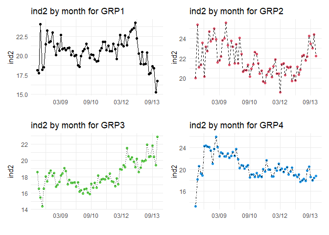

GLS Regression - organizing multiple series and potential models
================
Ann Nakamura

-   <a href="#1-use-case" id="toc-1-use-case">1 Use Case</a>
    -   <a href="#11-fakecohort1" id="toc-11-fakecohort1">1.1 FakeCohort1</a>
-   <a href="#2-organize-data" id="toc-2-organize-data">2 Organize data</a>
-   <a href="#3-data-preparation" id="toc-3-data-preparation">3 Data
    Preparation</a>
    -   <a href="#31-ols-run-assumptions-check-and-outlier-detection"
        id="toc-31-ols-run-assumptions-check-and-outlier-detection">3.1 OLS run:
        assumptions check and outlier detection</a>
-   <a href="#4-ols-vs-gls-model-comparisons"
    id="toc-4-ols-vs-gls-model-comparisons">4 OLS vs GLS Model
    Comparisons</a>
    -   <a href="#41-side-by-side-model-comparisons-and-anova-table"
        id="toc-41-side-by-side-model-comparisons-and-anova-table">4.1
        Side-by-side model comparisons and ANOVA table</a>
-   <a href="#5-summary-table" id="toc-5-summary-table">5 Summary Table</a>
-   <a href="#6-software-acknowledgements-most-recent-updates"
    id="toc-6-software-acknowledgements-most-recent-updates">6 Software
    acknowledgements (Most recent updates)</a>

<H1>

Formatting for scalability with minimal manual intervention

</H1>

# 1 Use Case

When a number of time series and models need to be looked at, the
following code uses list processing and functions applied to lists to
enable processing of a number of series and models for OLS and GLS
models and reduce the lines of code (goal \< 500 lines, with comments).
Tables with model characteristics are coerced into data frames and
formatted using the **gt** package. Packages **performance** and
**modelsummary**, and **patchwork** are used to quickly format tables
and diagnostic plots.

This demo uses the `gls()` function from the **nlme** package to compare
an OLS model with models that can account for non-independence of
observations (when what happens next in a time series is very much like
what happened before).

## 1.1 FakeCohort1

Examples use fake data, created using random group and variable
assignment. `FakeCohort1` contains a unique identifier (ID), a group
membership (GRP1–GRP4), a program membership (PGM1–PGM3), some
demographics (age), dates (MO,YR,dt), and a couple of numeric variables
(ind1 and ind2).

``` r
options(scipen=999)
db1 <- read.table("https://raw.githubusercontent.com/AMNakamura/miscellanea/master/datasets/FakeCohort1.txt",sep="|",header=T) 
```

# 2 Organize data

The following creates a vector for each series and creates lists of time
sereies aggregates and plots. Use the **patchwork** package’s
`wrap_plots()` function and `&` operator to print out all of the plots
and modify all of the themes at once.

``` r
library(tidyverse) ## Attach ggplot2, tidyr, stringr, and other commonly used packages 

series <- list()
plots  <- list()

glst <- sort(unique(as.character(db1[,2])))

# Simplified reporting of p-values for tables later
pstars <- function(prob){
     ifelse(prob < 0.001, "***",
     ifelse(prob < 0.01,"**",
     ifelse(prob < 0.05,"*","")))
}


for (g in glst){
  
i  <- as.numeric(gsub("[[:alpha:]]", "", g))  

# Make a time series for each glst element and store it in the series list.

series[[i]] <- subset(db1, GRP == g) %>%
               arrange(dt) %>%
               group_by(dt) %>%
               summarize(age.mu  = mean(age),
                         pctF    = round(mean(ifelse(GNDR=="F",1,0)),2),
                         pctP1   = round(mean(ifelse(PGM == "PGM1",1,0)),2),
                         ind1    = mean(ind1),
                         ind2    = mean(ind2)) %>%
               mutate_at(c("age.mu"), ~(scale(.,center=TRUE,scale=TRUE) %>% as.vector))  # center and scale 
   
# Make a plot for each of the above time series and store them in the plots list. 

plots[[i]] <- ggplot(data = series[[i]], aes(x=as.Date(dt),y=ind2)) +
                geom_point(color=i) +
                geom_line( aes(group=1), linetype = i) +
                scale_x_date(date_labels = "%m/%y", date_breaks ="18 months") +
                labs(title = glue::glue("ind2 by month for {g}"),
                     x=" ")
}

library(patchwork)

wrap_plots(plots) & theme_minimal()
```
<center>

</center>

# 3 Data Preparation

Testing the effects of **age, gender distribution, and program
participation** on **ind2** (sample), the following fits a multiple
linear regression model with autocorrelated errors and seasonal terms.
Data aren’t transformed beyond differencing.

First, decompose the `ind2` time series. Pick one for processing.

``` r
library(forecast)

Grp <- series[[2]] %>%
  mutate(dt = as.Date(dt)) %>%
  dplyr::select(ind2,age.mu,pctF,pctP1,dt)

# Decompose `ind2` into trend, autocorrelation, seasonal, and residual components.
tind2 <- ts(Grp[,1], frequency = 12, start = c(2008,1))
tcomp1 <- decompose(tind2)
tcomp.p1 <- forecast::autoplot(tcomp1,main="Decomposition \nBefore Differencing") # Use autoplot to create a ggplot object for patchwork
```

After applying the `ndiffs()` function from the **forecast** package to
all columns at once to calculate the number of differences needed to
make each series stationary, test for cointegration using the
Engle-Granger(or EG) test. If the first column is the response and the
last column is the date, the following performs a cointegration test on
all columns compared to the response. Use list processing to apply the
cointegration tests and the **gt** package to format the output.

``` r
nd <- as.data.frame(sapply(Grp,ndiffs)) # Named numeric vector

library(aTSA) # for a quick cointegration test
library(gt) # pretty tables

plst <- names(Grp)[2:length(names(Grp))-1]

coint <- list()

for (i in plst){
  c <- which(plst == i)
  coint[[c]] <- coint.test(unlist(Grp[,1]), unlist(Grp[,c]), d = 1, output = F) %>%
                as.data.frame() %>%
                mutate(vname = i,
                       EG    = round(EG,2)) %>%
                dplyr::select(vname,lag, EG, p.value)
}

z<- bind_rows(coint) %>%
    group_by(vname, lag) %>%
    gt() %>%
    tab_header(
      title = md(glue::glue("Cointegration Tests <br> Ind2 ~ Predictors")),
       subtitle = "Fake Cohort Data") %>%
    tab_footnote(
      footnote = "Completely random data. ",
      locations = cells_title(groups="title")) 

invisible(gtsave(z,"coint.png",vwidth=500))

coint_png <- png::readPNG('coint.png', native=TRUE)
```

The following, after applying a non-seasonal difference to help
de-trend, puts the decomposition charts (before and after),
cointegration results, and results from the Durbin-Watson test all in
one graph for convenience.

``` r
GrpD <- as.data.frame(lapply(Grp, diff, lag=1))  # Takes the difference of response and dependents

GrpD$t <- as.numeric(as.character(rownames(GrpD))) # Create a time variable for graphing

tindD <- ts(GrpD[,1], frequency = 12, start = c(2008,2))  # Differenced time series for the response.

tcomp2 <- decompose(tindD)

tcomp.p2 <- forecast::autoplot(tcomp2, main="Decomposition \nAfter Differencing") 

z <- wrap_plots(tcomp.p1,tcomp.p2) + coint_png & theme_minimal()
```
<center>

</center>

The following example uses fourier series,
instead of dummies, to account for seasonality and to reduce the number
of regression terms added to the model.

``` r
# Helper function to find the number of fourier terms (k) that give the best fit for tind2, courtesy https://robjhyndman.com/hyndsight/forecasting-weekly-data/. 

bestfit <- list(aicc=Inf)
for(i in 1:4)
{
  fit <- auto.arima(tindD, xreg=fourier(tindD, K=i), seasonal=FALSE)
  if(fit$aicc < bestfit$aicc)
    bestfit <- fit
  else break;
  bestK <- i
 }

fterms <- fourier(tindD, K=1) # Create the seasonal terms 

GrpD <- cbind(GrpD, fterms) # Add to the data frame

colnames(GrpD)[7:8] <- c("S1","C1") # Rename 
```

## 3.1 OLS run: assumptions check and outlier detection

Examine the performance of the OLS regression model. Use diagnostic
plots to identify outliers and influential observations. Remove outliers
and re-run.

``` r
library(modelsummary)

# For convenience, use the **performance** package to quickly obtain a series of standard model diagnostic charts.  

library(performance) # Functions for measuring overdispersion, autocorrelation, and other diagnostics
library(see) # to visualize diagnostics
library(ggplot2) #reload later version

mod.lm <- lm(ind2 ~ age.mu + pctF + pctP1 + S1 + C1 , data=GrpD)

library(performance)
ols.chk1 <- check_model(mod.lm,verbose=FALSE)

GrpDo <- GrpD[3:71,]  # Removes observation # 1, an outlier and influential observation

mod.lm <- lm(ind2 ~ age.mu + pctF + pctP1 + S1 + C1 , data=GrpDo)


png(filename="check_model.png",width = 600, height = 600)
check_model(mod.lm,verbose=FALSE)
dev.off()
```

<center>

</center>

The following checks for independence of residuals.

``` r
# Check residuals 
p.res <- qplot(x=as.numeric(GrpDo$t), y=residuals(mod.lm)) + 
     geom_hline(yintercept=0,lty=2, color='red') +
  xlab("time")

p.acf  <- invisible(autoplot(acf(residuals(mod.lm))))
```

``` r
p.pacf <- invisible(autoplot(pacf(residuals(mod.lm))))
```

``` r
# Durbin-Watson test. 
library(lmtest)
dw <- dwtest(mod.lm, alternative="two.sided")
```

``` r
p.res/wrap_plots(p.acf,p.pacf) + plot_annotation(
  title = "Residuals check, autocorrelation, partial autocorrelation",
  caption = paste0("Durbin-Watson test: p =", round(dw$p.value,4))) & theme_minimal()
```
<center>

</center>

# 4 OLS vs GLS Model Comparisons

## 4.1 Side-by-side model comparisons and ANOVA table

``` r
library(nlme)

# NULL (OLS)
mod.gls0 <- gls(ind2 ~ age.mu + pctF + pctP1 + S1 + C1 ,
                data=GrpDo, 
                correlation = NULL, method="ML")    # Null model.
# MA(1)
mod.gls1 <- gls(ind2 ~ age.mu + pctF + pctP1 + S1 + C1 , data=GrpDo, 
                      correlation = corARMA(q=1), method="ML")
# Note, for ANOVA model comparisons, models have to be fit using the same estimation method. 

models <- list(mod.gls0, mod.gls1)

tmp<- modelsummary(models, output="gt", 
  fmt = 2,
  estimate="{estimate} ({std.error}){stars}",
  statistic = NULL)  %>%
  tab_header(
    title = md(glue::glue("GLS models <br> Ind2 ~ Predictors")),
     subtitle = "Fake Cohort Data") %>%
  tab_footnote(
    footnote = "Linear models regressing ind2 on age, percent identifying as female, percent 'program 1'. Completely random data. ",
    locations = cells_title(groups="title")) %>%
  tab_footnote(
    footnote = " + p ~ .1, * p <=.05, ** p<=.01, *** p<=0.001",
    locations =  cells_title(groups="title")) %>%
   cols_label(
    `Model 1` = "OLS",
    `Model 2`= "MA(1)"
  )

invisible(gtsave(tmp,"modelcompare1.png"))
```

<center>

</center>

The following runs an anova() test to see if the more complex model(s)
is/are better than the simpler model(s). Use lists, as needed, flatten
list into a data frame, apply helper functions (e.g., `pstars()`) and
organize using **gt** tab headers, footers, footnotes, etc.

``` r
a1 <- anova(mod.gls0, mod.gls1) 

models <- list(a1)
names(models) <- c("MA1 vs NULL")

options(scipen=999)

models.df <- as.data.frame(do.call(rbind, lapply(models, as.data.frame))) %>%
  mutate(model=rownames(.),
         `p-value` = pstars(`p-value`)) %>%
  dplyr::select(model, df, BIC, logLik, L.Ratio, `p-value`) %>%
  gt() %>%
  tab_header(
    title = md(glue::glue("AVOVA Result <br> GLS models with AR/MA/ARMA terms")),
     subtitle = "Fake Cohort Data") %>%
  tab_footnote(
    footnote = "Linear models regressing ind2 on age, percent identifying as female, percent 'program 1'. Completely random data. ",
    locations = cells_title(groups="title")) %>%
  tab_footnote(
    footnote = " + p ~ .1, * p <=.05, ** p<=.01, *** p<=0.001",
    locations =  cells_title(groups="title"))

invisible(gtsave(tmp,"modelcompare2.png"))
```

<center>

</center>


# 5 Summary Table

``` r
tmp <- modelsummary(mod.gls1, output="gt", 
  fmt = 2,
  estimate="{estimate} ({std.error}){stars}",
  statistic = NULL)  %>%
  tab_header(
    title = md(glue::glue("GLS Model <br> 1st Order Moving Average")),
     subtitle = "Fake Cohort Data") %>%
  tab_footnote(
    footnote = "Linear model regressing ind2 on age, percent identifying as female, percent 'program 1'. Completely random, made-up data. ",
    locations = cells_title(groups="title")) %>%
  tab_footnote(
    footnote = " + p ~ .1, * p <=.05, ** p<=.01, *** p<=0.001",
    locations =  cells_title(groups="title"))

invisible(gtsave(tmp,"modelfinal.png"))
```
<center>

</center>


# 6 Software acknowledgements (Most recent updates)

Thomas Lin Pedersen (2020). patchwork: The Composer of Plots. R package
version 1.1.1. <https://CRAN.R-project.org/package=patchwork>

Wickham et al., (2019). Welcome to the tidyverse. Journal of Open Source
Software, 4(43), 1686, <https://doi.org/10.21105/joss.01686>

Pinheiro J, Bates D, DebRoy S, Sarkar D, R Core Team (2021). *nlme:
Linear and Nonlinear Mixed Effects Models*. R package version 3.1-153,
\<URL: <a href="https://CRAN.R-project.org/package=nlme\"
class="uri">https://CRAN.R-project.org/package=nlme\</a>\>.

Hyndman R, Athanasopoulos G, Bergmeir C, Caceres G, Chhay L, O’Hara-Wild
M, Petropoulos F, Razbash S, Wang E, Yasmeen F (2022). *forecast:
Forecasting functions for time series and linear models*. R package
version 8.17.0, \<URL: <a href="https://pkg.robjhyndman.com/forecast/\"
class="uri">https://pkg.robjhyndman.com/forecast/\</a>\>.

Hyndman RJ, Khandakar Y (2008). “Automatic time series forecasting: the
forecast package for R.” *Journal of Statistical Software*, *26*(3),
1-22. doi: 10.18637/jss.v027.i03 (URL:
<https://doi.org/10.18637/jss.v027.i03>).

Debin Qiu (2015). aTSA: Alternative Time Series Analysis. R package
version 3.1.2. <https://CRAN.R-project.org/package=aTSA>

Richard Iannone, Joe Cheng and Barret Schloerke (2022). gt: Easily
Create Presentation-Ready Display Tables. R package version 0.6.0.
<https://CRAN.R-project.org/package=gt>

Achim Zeileis, Torsten Hothorn (2002). Diagnostic Checking in Regression
Relationships. R News 2(3), 7-10. URL
<https://CRAN.R-project.org/doc/Rnews/>

Thomas Lin Pedersen (2020). patchwork: The Composer of Plots. R package
version 1.1.1. <https://CRAN.R-project.org/package=patchwork>

Arel-Bundock V (2022). “modelsummary: Data and Model Summaries in R.”
*Journal of Statistical Software*, *103*(1), 1-23. doi:
10.18637/jss.v103.i01 (URL: <https://doi.org/10.18637/jss.v103.i01>).

Lüdecke et al., (2021). see: An R Package for Visualizing Statistical
Models. Journal of Open Source Software, 6(64), 3393.
<https://doi.org/10.21105/joss.03393>

H. Wickham. ggplot2: Elegant Graphics for Data Analysis. Springer-Verlag
New York, 2016.
