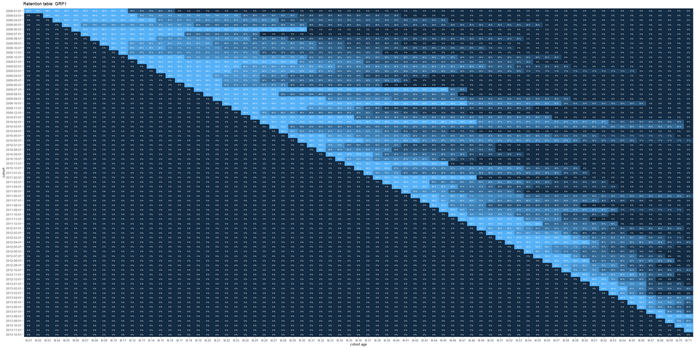
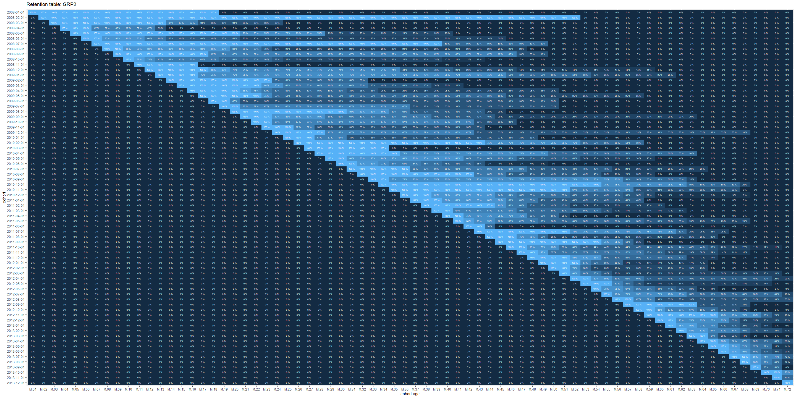
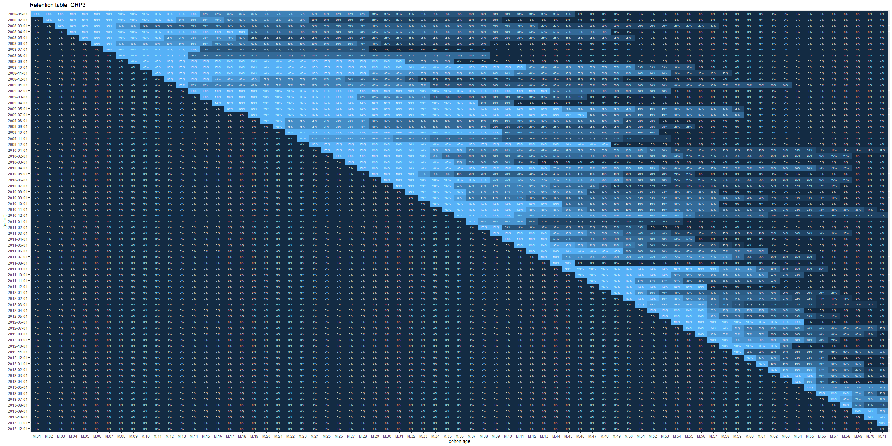
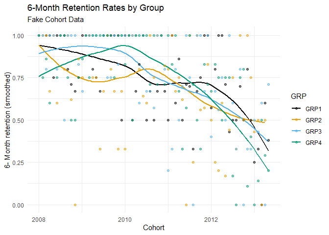

Measuring and Visualizing Retention
================
Ann Nakamura
2/4/2019

-   [1 Use Case](#1-use-case)
-   [2 Data Preparation](#2-data-preparation)
-   [3 Group-specific retention
    grids](#3-group-specific-retention-grids)
-   [4 Calculating N-Period Retention
    Rates](#4-calculating-n-period-retention-rates)
-   [5 Comparing Group-specific Retention Rates Over
    Time](#5-comparing-group-specific-retention-rates-over-time)
-   [6 Packages](#6-packages)

# 1 Use Case

Create a quick visualization to examine retention for group members who
enter and exit at random points in time. Uses a [Fake
cohort](https://raw.githubusercontent.com/AMNakamura/miscellanea/master/datasets/FakeCohort1.txt)
for demonstration purposes.

``` r
library(tidyverse)   # adding variables, other data manipulation
library(lubridate)

db1 <- read.table("https://raw.githubusercontent.com/AMNakamura/miscellanea/master/datasets/FakeCohort1.txt",sep="|",header=T) %>% 
  group_by(ID,YR,MO,GRP) %>%
  summarise(IND = sum(ind1)) %>%
  dplyr::select(ID,YR,MO,GRP,IND) %>%
  mutate(dt = as.Date(paste(YR,MO,"01",sep="-"))) # set to first of the month for simplicity
```

# 2 Data Preparation

-   Assign each member to a date-based cohort.
-   Expand to include all possible cohort periods.

``` r
# All possible dates
dates <- sort(as.Date(unique(db1$dt)))

# Create the cohort input dataset
makeCohort <- function(G){
cohort0 <- subset(db1,GRP == G) %>%  
  arrange(ID,dt) %>%                
  group_by(ID) %>%
  mutate(first.date = dplyr::first(dt)) %>% # first group-entry date
  ungroup() %>%
  select(ID,first.date,dt,IND,GRP) %>%
  complete(ID,dt = seq.Date(dates[1], dates[72], by="month")) %>%
  group_by(ID) %>%
  fill(c("GRP","first.date"),.direction="updown") %>%
  mutate(IND = ifelse(is.na(IND) | IND < 0, 0,1)) %>%
  ungroup()

}
```

### 2.0.1 Retention cohort list processing

The following creates the retention grids, in the form of right
triangular matrices, over all groups in the original cohort file. The
grids are then transformed from wide to long, treating cohort_age (month
number) and members (cohort size) as a key-value pairs. The long-form
data, with three columns: the cohort, the cohort age (month number), and
size, can then be used for graphing and further analysis.

Cohort grid and graphs use modified versions of code originally shared
by [Jules
Stuiferbergen](https://stuifbergen.com/2018/03/cohort-analysis-with-snowplow-and-r/).
The following combines the original helper functions and data frame
modification with list processing to create retention grids for all
groups in the cohort, sequentially.

``` r
# Helper functions

shiftrow <- function(v) {
  # put a vector in, strip off leading NA values, and place that amount at the end
  first_na_index <- min( which(!is.na(v)) )
  
  # return that bit to the end,  and pad with NAs.
  c(v[first_na_index:length(v)], rep(NA, first_na_index-1))
}

pretty_print <- function(n) {
  case_when( n <= 1  ~ sprintf("%1.0f %%", n*100),
             n >  1  ~ as.character(n),
             TRUE    ~ " ") # for NA values, skip the label

}
```

``` r
grid.raw <- list() # Raw retention aggregates
grid.pct <- list() # Retention percentages

plot.raw <- list()
plot.pct <- list()


for (g in glst){
  
i  <- as.numeric(gsub("[[:alpha:]]", "", g))  

dbin <- cohorts[[i]]

# Create a new dataframe, with shifted rows, while keeping the first column.
grid.tmp <- data.frame(
    cohort = dbin$entry,
    t(apply( select(as.data.frame(dbin), 2:ncol(dbin)), # 2nd column to the end
           1, # for every row
           shiftrow )))

# Make column names readable. 
# First column should be "cohort." The remaining are enumerated.Keep the padding. 
colnames(grid.tmp) <- c("cohort", sub("","M.", str_pad(1:(ncol(grid.tmp)-1),2,pad = "0")))

# Find the size of the original cohort (min_Mx)
grid.tmp$min_Mx <- apply(grid.tmp[ , grepl("M.", names(grid.tmp))],
                        1, function(x){head(x[!x==0],1)})

grid.raw[[i]] <- grid.tmp

# Calculate the percent in subsequent time periods, relative to the original cohort.
grid.pct[[i]] <- data.frame(
  cohort = grid.raw[[i]]$cohort, # first column
  grid.raw[[i]][,1:nrow(grid.raw[[i]])+1] / grid.raw[[i]]$min_Mx) # Columns M.1 - M.72 (71 total)

grid.pct[[i]] <- grid.pct[[i]] %>%
 mutate_if(is.numeric, round,2)

plot.raw[[i]] <- gather(grid.raw[[i]] , "cohort_age", "people"  ,2:ncol(grid.raw[[i]]    ))
plot.pct[[i]] <- gather(grid.pct[[i]],  "cohort_age", "percent" ,2:ncol(grid.pct[[i]])) %>%
  mutate(label.pct = pretty_print(percent))

}
```

# 3 Group-specific retention grids

Look at retention grid snapshots, by group, to get a sense of patterns.

``` r
for (g in glst){
  
i  <- as.numeric(gsub("[[:alpha:]]", "", g))  

print(ggplot(plot.pct[[i]], aes(x = cohort_age, y = reorder(cohort, desc(cohort)))) +
  geom_raster(aes(fill = percent)) +
  scale_fill_continuous(guide = FALSE) + # no legend
  geom_text(aes(label = label.pct), color = "white", size=2) +
  xlab("cohort age") + ylab("cohort") + 
  ggtitle(glue::glue("Retention table: {g}")))

}
```



# 4 Calculating N-Period Retention Rates

The next section uses the previously created retention grids to extract
the n-period (e.g., 6-month) retention rate across all cohorts.

Steps:

-   Find the column name with the first nonzero value for members
    (`first.per`).
-   Find the column name `n` periods after `first.per`, `retention.col`.
-   Save the retention percentage for `retention.col` in a new column.

``` r
n <- 6
nx <- nrow(grid.raw[[1]]) - n -1  # Last cohort with an n-period retention

n.retention <- list()

for (g in glst){
  
i  <- as.numeric(gsub("[[:alpha:]]", "", g))  

# Find the column with the the n-period retention rate
# First, find the first period column with a nonzero value in the retention grid.
df <- grid.raw[[i]]

entryM = as.data.frame(apply(df[ , grepl("M", names(df))], 1, function(x) {
  names(x)[min(which(x > 0))]
  })) %>%
  dplyr::rename(first.per = 1)

# Add 6 periods to the entry period.

entryM$retention.col <- paste0("M.",str_pad(as.numeric(gsub("[[:alpha:]]", "", entryM$first.per))*100 + n,2,pad="0"))

# Attach the name of the column with the n-month retention rate to the retention grid.

df <- cbind.data.frame(grid.pct[[i]],entryM)

# Save the value of the n-period retention rate in a column named retention,
# create a variable for time, add the group name, and save.

n.retention[[i]] <- df[1:nx ,] %>%
  rowwise %>%
  rownames_to_column(., "t") %>%
  mutate(retention = .[[which(rownames(.) == t),which(names(.) == retention.col)]]) %>%
  dplyr::select(t,cohort,retention.col,retention)%>%
  mutate(GRP = g)
}
```

# 5 Comparing Group-specific Retention Rates Over Time

To deal with over-plotting and to help see patterns more clearly, graph
with local regression (loess) smoothing.

``` r
# Collapse the lists
grps.ret <- as.data.frame(do.call(rbind, lapply(n.retention, as.data.frame)))

# Load a colorblind-friendly palette 
cbbPalette <- c("#000000", "#E69F00", "#56B4E9", "#009E73", "#F0E442", "#0072B2", "#D55E00", "#CC79A7")

ggplot(data=grps.ret, aes(x=as.Date(cohort), y=retention, color=GRP)) +
    geom_smooth(se = FALSE) +
    geom_point(alpha=.5) +
   theme_minimal() + 
   scale_colour_manual(values=cbbPalette) +
     labs(title = glue::glue("{n}-Month Retention Rates by Group"),
        subtitle = "Fake Cohort Data",
        x="Cohort",
        y=glue::glue("{n}- Month retention (smoothed)"))
```



# 6 Packages

Wickham et al., (2019). Welcome to the tidyverse. Journal of Open Source
Software, 4(43), 1686, <https://doi.org/10.21105/joss.01686>

Garrett Grolemund, Hadley Wickham (2011). Dates and Times Made Easy with
lubridate. Journal of Statistical Software, 40(3), 1-25. URL:
<https://www.jstatsoft.org/v40/i03/>.
