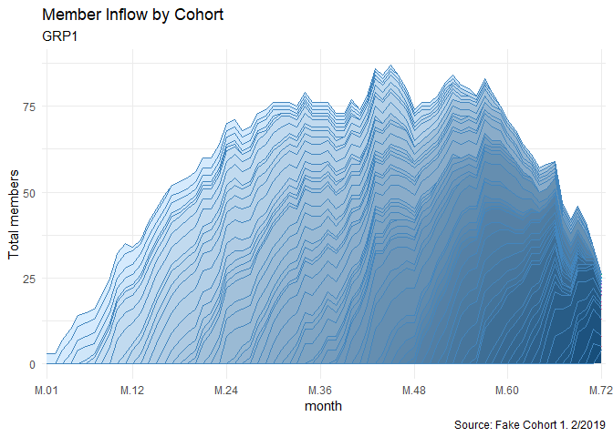
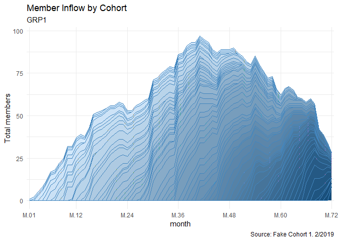
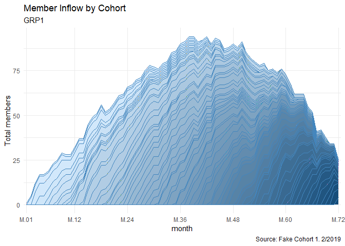

Measuring and Visualizing Retention
================
Ann Nakamura
2/4/2019

-   [1 Use Case](#1-use-case)
-   [2 Data Preparation](#2-data-preparation)
-   [3 “Layer Cakes”](#3-layer-cakes)
-   [4 Packages](#4-packages)
-   [5 References](#5-references)

<h1 style="color: #154c79">

Using Layer Cakes

</h1>

# 1 Use Case

Create a quick visualization, using [layer cake
graphs](https://thinkinsights.net/digital/cohort-analysis-using-layer-cake-graphs-with-r/)
to examine retention for group members who enter and exit at random
points in time. Uses a [Fake
cohort](https://raw.githubusercontent.com/AMNakamura/miscellanea/master/datasets/FakeCohort1.txt)
for demonstration purposes.

``` r
library(tidyverse)   # adding variables, other data manipulation
library(lubridate)

db1 <- read.table("https://raw.githubusercontent.com/AMNakamura/miscellanea/master/datasets/FakeCohort1.txt",sep="|",header=T) %>% 
  group_by(ID,YR,MO,GRP) %>%
  summarise(IND = sum(ind1)) %>%
  dplyr::select(ID,YR,MO,GRP,IND) %>%
  mutate(dt = as.Date(paste(YR,MO,"01",sep="-"))) # set to first of the month for simplicity
```

# 2 Data Preparation

-   Assign each member to a date-based cohort.
-   Expand to include all possible cohort periods.

``` r
# All possible dates
dates <- sort(as.Date(unique(db1$dt)))

# Create the cohort input dataset
makeCohort <- function(G){
cohort0 <- subset(db1,GRP == G) %>%  
  arrange(ID,dt) %>%                
  group_by(ID) %>%
  mutate(first.date = dplyr::first(dt)) %>% # first group-entry date
  ungroup() %>%
  select(ID,first.date,dt,IND,GRP) %>%
  complete(ID,dt = seq.Date(dates[1], dates[72], by="month")) %>%
  group_by(ID) %>%
  fill(c("GRP","first.date"),.direction="updown") %>%
  mutate(IND = ifelse(is.na(IND) | IND < 0, 0,1)) %>%
  ungroup()

}
```

### 2.0.1 Retention cohort list processing

The following creates the retention grids, in the form of right
triangular matrices, over all groups in the original cohort file. The
grids are then transformed from wide to long, treating cohort_age (month
number) and members (cohort size) as a key-value pairs. The long-form
data, with three columns: the cohort, the cohort age (month number), and
size, can then be used for graphing and further analysis.

``` r
# Helper functions

shiftrow <- function(v) {
  # put a vector in, strip off leading NA values, and place that amount at the end
  first_na_index <- min( which(!is.na(v)) )
  
  # return that bit to the end,  and pad with NAs.
  c(v[first_na_index:length(v)], rep(NA, first_na_index-1))
}

pretty_print <- function(n) {
  case_when( n <= 1  ~ sprintf("%1.0f %%", n*100),
             n >  1  ~ as.character(n),
             TRUE    ~ " ") # for NA values, skip the label

}
```

``` r
grid.raw <- list() # Raw retention aggregates
grid.pct <- list() # Retention percentages

plot.raw <- list()
plot.pct <- list()


for (g in glst){
  
i  <- as.numeric(gsub("[[:alpha:]]", "", g))  

dbin <- cohorts[[i]]

# Create a new dataframe, with shifted rows, while keeping the first column.
grid.tmp <- data.frame(
    cohort = dbin$entry,
    t(apply( select(as.data.frame(dbin), 2:ncol(dbin)), # 2nd column to the end
           1, # for every row
           shiftrow )))

# Make column names readable. 
# First column should be "cohort." The remaining are enumerated.Keep the padding. 
colnames(grid.tmp) <- c("cohort", sub("","M.", str_pad(1:(ncol(grid.tmp)-1),2,pad = "0")))

# Find the size of the original cohort (min_Mx)
grid.tmp$min_Mx <- apply(grid.tmp[ , grepl("M.", names(grid.tmp))],
                        1, function(x){head(x[!x==0],1)})

grid.raw[[i]] <- grid.tmp

# Calculate the percent in subsequent time periods, relative to the original cohort.
grid.pct[[i]] <- data.frame(
  cohort = grid.raw[[i]]$cohort, # first column
  grid.raw[[i]][,1:nrow(grid.raw[[i]])+1] / grid.raw[[i]]$min_Mx) # Columns M.1 - M.72 (71 total)

grid.pct[[i]] <- grid.pct[[i]] %>%
 mutate_if(is.numeric, round,2)

plot.raw[[i]] <- gather(grid.raw[[i]] , "cohort_age", "people"  ,2:ncol(grid.raw[[i]]    ))
plot.pct[[i]] <- gather(grid.pct[[i]],  "cohort_age", "percent" ,2:ncol(grid.pct[[i]])) %>%
  mutate(label.pct = pretty_print(percent))

}
```

# 3 “Layer Cakes”

-   Show total growth over time
-   Lighter areas (“layers”) represent earlier cohorts
-   Plateaus: growth equals attrition
-   Inclines: growth outpaces attrition
-   Declines: Attrition outpaces growth

``` r
for (g in glst){
  
i  <- as.numeric(gsub("[[:alpha:]]", "", g))  

df <- plot.raw[[i]] %>%
  dplyr::filter(cohort_age != 'min_Mx') %>%
  group_by(cohort) %>%
  mutate(group_id = cur_group_id()) %>%
  ungroup()


colnames(df) <- c('cohort', 'mo', 'members')
blues <- colorRampPalette(c('#d8edff', '#154c79'))

blues(unique(df$group_id))

print(ggplot(df, aes(x=mo, y=members, group=cohort,color=cohort)) + 
  geom_area(aes(fill = cohort)) +
  geom_line(aes(y=members),position="stack",color="#4386be",size=.1) +
  scale_fill_manual(values = blues(n_distinct(df$cohort))) +
 scale_x_discrete(breaks=c("M.01","M.12","M.24","M.36","M.48","M.60","M.72")) + 
 labs(x="month",
             y="Total members",
             title="Member Inflow by Cohort", 
             subtitle="GRP1", 
             caption = paste("Source: Fake Cohort 1.", "2/2019")) +
  theme_minimal() + 
  theme(legend.position="None") )
}
```

<!-- --><!-- --><!-- --><!-- -->

# 4 Packages

Wickham et al., (2019). Welcome to the tidyverse. Journal of Open Source
Software, 4(43), 1686, <https://doi.org/10.21105/joss.01686>

Garrett Grolemund, Hadley Wickham (2011). Dates and Times Made Easy with
lubridate. Journal of Statistical Software, 40(3), 1-25. URL:
<https://www.jstatsoft.org/v40/i03/>.

# 5 References

Think Insights (August 2, 2022) Cohort Analysis using layer-cake graphs.
Retrieved from
<https://thinkinsights.net/digital/cohort-analysis-using-layer-cake-graphs-with-r/>.
